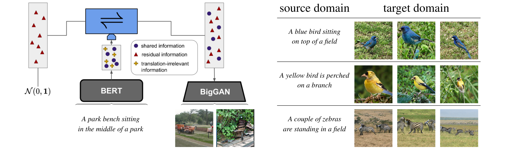
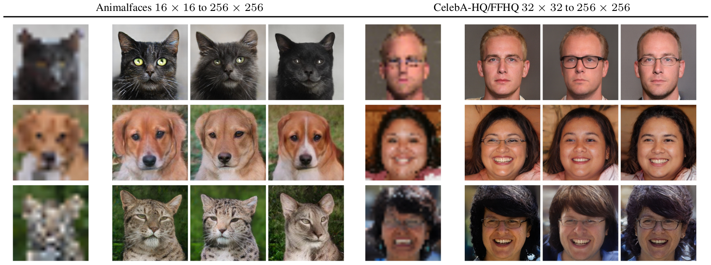
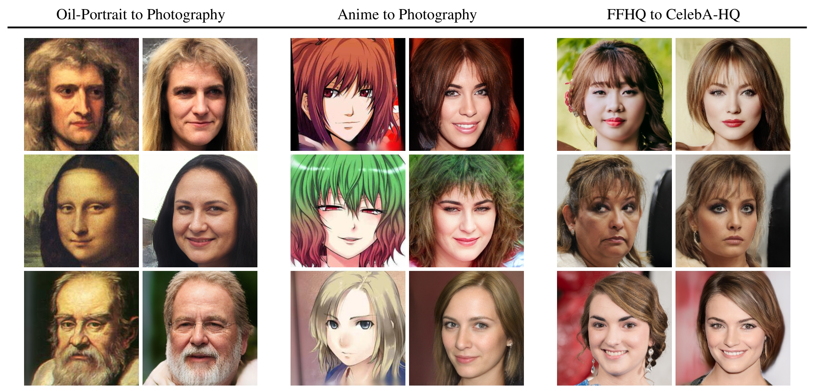
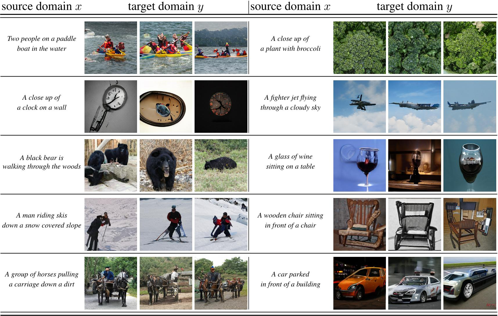

# Net2Net
Code accompanying the NeurIPS 2020 oral paper

[**Network-to-Network Translation with Conditional Invertible Neural Networks**](https://compvis.github.io/net2net/)<br/>
[Robin Rombach](https://github.com/rromb)\*,
[Patrick Esser](https://github.com/pesser)\*,
[Björn Ommer](https://hci.iwr.uni-heidelberg.de/Staff/bommer)<br/>
\* equal contribution

**tl;dr** Our approach distills the residual information of one model with respect to
another's and thereby enables translation between fixed off-the-shelf expert
models such as BERT and BigGAN without having to modify or finetune them.


[arXiv](https://arxiv.org/abs/2005.13580) | [BibTeX](#bibtex) | [Project Page](https://compvis.github.io/net2net/)

**News Dec 19th, 2020**: added SBERT-to-BigGAN, SBERT-to-BigBiGAN and SBERT-to-AE (COCO) 
## Requirements
A suitable [conda](https://conda.io/) environment named `net2net` can be created
and activated with:

```
conda env create -f environment.yaml
conda activate net2net
```

## Datasets
- **CelebA**: Create a symlink 'data/CelebA' pointing to a folder which contains the following files:
    ```  
  .
    ├── identity_CelebA.txt
    ├── img_align_celeba
    ├── list_attr_celeba.txt
    └── list_eval_partition.txt
  ```
  These files can be obtained [here](http://mmlab.ie.cuhk.edu.hk/projects/CelebA.html).
- **CelebA-HQ**: Create a symlink `data/celebahq` pointing to a folder containing
  the `.npy` files of CelebA-HQ (instructions to obtain them can be found in
  the [PGGAN repository](https://github.com/tkarras/progressive_growing_of_gans)).
- **FFHQ**: Create a symlink `data/ffhq` pointing to the `images1024x1024` folder
  obtained from the [FFHQ repository](https://github.com/NVlabs/ffhq-dataset).
- **Anime Faces**: First download the face images from the [Anime Crop dataset](https://www.gwern.net/Crops) and then apply
  the preprocessing of [FFHQ](https://github.com/NVlabs/ffhq-dataset) to those images. We only keep images 
  where the underlying [dlib face recognition model](http://dlib.net/face_landmark_detection.py.html) recognizes 
  a face. Finally, create a symlink `data/anime` which contains the processed anime face images.
- **Oil Portraits**: [Download here.](https://heibox.uni-heidelberg.de/f/4f35bdc16eea4158aa47/?dl=1)
  Unpack the content and place the files in `data/portraits`. It consists of
  18k oil portraits, which were obtained by running [dlib](http://dlib.net/face_landmark_detection.py.html) on a subset of the [WikiArt dataset](https://www.wikiart.org/)
  dataset, kindly provided by [A Style-Aware Content Loss for Real-time HD Style Transfer](https://github.com/CompVis/adaptive-style-transfer).
- **COCO**: Create a symlink `data/coco` containing the images from the 2017
  split in `train2017` and `val2017`, and their annotations in `annotations`.
  Files can be obtained from the [COCO webpage](https://cocodataset.org).

## ML4Creativity Demo
We include a [streamlit](https://www.streamlit.io/) demo, which utilizes our
approach to demonstrate biases of datasets and their creative applications.
More information can be found in our paper [A Note on Data Biases in Generative
Models](https://drive.google.com/file/d/1PGhBTEAgj2A_FnYMk_1VU-uOxcWY076B/view?usp=sharing) from the [Machine Learning for Creativity and Design](https://neurips2020creativity.github.io/) at [NeurIPS 2020](https://nips.cc/Conferences/2020). Download the models from

- [2020-11-30T23-32-28_celeba_celebahq_ffhq_256](https://k00.fr/lro927bu)
- [2020-12-02T13-58-19_anime_photography_256](https://heibox.uni-heidelberg.de/d/075e81e16de948aea7a1/)
- [2020-12-02T16-19-39_portraits_photography_256](https://k00.fr/y3rvnl3j)


and place them into `logs`. Run the demo with

```
streamlit run ml4cad.py
```

## Training
Our code uses [Pytorch-Lightning](https://www.pytorchlightning.ai/) and thus natively supports
things like 16-bit precision, multi-GPU training and gradient accumulation. Training details for any model need to be specified in a dedicated `.yaml` file.
In general, such a config file is structured as follows:
```
model:
  base_learning_rate: 4.5e-6
  target: <path/to/lightning/module>
  params:
    ...
data:
  target: translation.DataModuleFromConfig
  params:
    batch_size: ...
    num_workers: ...
    train:
      target: <path/to/train/dataset>
      params:
        ...
    validation:
      target: <path/to/validation/dataset>
      params:
        ...
```
Any Pytorch-Lightning model specified under `model.target` is then trained on the specified data
by running the command:
```
python translation.py --base <path/to/yaml> -t --gpus 0,
```
All available Pytorch-Lightning [trainer](https://pytorch-lightning.readthedocs.io/en/stable/trainer.html) arguments can be added via the command line, e.g. run
```
python translation.py --base <path/to/yaml> -t --gpus 0,1,2,3 --precision 16 --accumulate_grad_batches 2
```
to train a model on 4 GPUs using 16-bit precision and a 2-step gradient accumulation.
More details are provided in the examples below.

### Training a cINN
Training a cINN for network-to-network translation usually utilizes the Lighnting Module `net2net.models.flows.flow.Net2NetFlow`
and makes a few further assumptions on the configuration file and model interface:
```
model:
  base_learning_rate: 4.5e-6
  target: net2net.models.flows.flow.Net2NetFlow
  params:
    flow_config:
      target: <path/to/cinn>
      params:
        ...

    cond_stage_config:
      target: <path/to/network1>
      params:
        ...

    first_stage_config:
      target: <path/to/network2>
      params:
        ...
```
Here, the entries under `flow_config` specifies the architecture and parameters of the conditional INN; 
`cond_stage_config` specifies the first network whose representation is to be translated into another network
specified by `first_stage_config`.  Our model `net2net.models.flows.flow.Net2NetFlow` expects that the first  
network has a `.encode()` method which produces the representation of interest, while the second network should
have an `encode()` and a `decode()` method, such that both of them applied sequentially produce the networks output. This allows for a modular combination of arbitrary models of interest. For more details, see the examples below.

### Training a cINN - Superresolution
 
Training details for a cINN to concatenate two autoencoders from different image scales for stochastic
superresolution are specified in `configs/translation/faces32-to-256.yaml`. 

To train a model for translating from 32 x 32 images to 256 x 256 images on GPU 0, run
```
python translation.py --base configs/translation/faces32-to-faces256.yaml -t --gpus 0, 
``` 
and specify any additional training commands as described above. Note that this setup requires two
pretrained autoencoder models, one on 32 x 32 images and the other on 256 x 256. If you want to
train them yourself on a combination of FFHQ and CelebA-HQ, run
```
python translation.py --base configs/autoencoder/faces32.yaml -t --gpus <n>, 
```
for the 32 x 32 images; and 
```
python translation.py --base configs/autoencoder/faces256.yaml -t --gpus <n>, 
```
for the model on 256 x 256 images. After training, adopt the corresponding model paths in `configs/translation/faces32-to-faces256.yaml`. Additionally, we provide weights of pretrained autoencoders for both settings: 
[Weights 32x32](https://heibox.uni-heidelberg.de/f/b0b103af8406467abe48/);  [Weights256x256](https://k00.fr/94lw2vlg). 
To run the training as described above, put them into 
`logs/2020-10-16T17-11-42_FacesFQ32x32/checkpoints/last.ckpt`and 
`logs/2020-09-16T16-23-39_FacesXL256z128/checkpoints/last.ckpt`, respectively.

### Training a cINN - Unpaired Translation
 
All training scenarios for unpaired translation are specified in the configs in `configs/creativity`.
We provide code and pretrained autoencoder models for three different translation tasks:
- **Anime** ⟷ **Photography**; see `configs/creativity/anime_photography_256.yaml`. 
  Download autoencoder checkpoint ([Download Anime+Photography](https://heibox.uni-heidelberg.de/f/315c628c8b0e40238132/)) and place into `logs/2020-09-30T21-40-22_AnimeAndFHQ/checkpoints/epoch=000007.ckpt`. 
- **Oil-Portrait** ⟷ **Photography**; see `configs/creativity/portraits_photography_256.yaml`
  Download autoencoder checkpoint ([Download Portrait+Photography](https://heibox.uni-heidelberg.de/f/4f9449418a2e4025bb5f/)) and place into `logs/2020-09-29T23-47-10_PortraitsAndFFHQ/checkpoints/epoch=000004.ckpt`.
- **FFHQ** ⟷ **CelebA-HQ** ⟷ **CelebA**; see `configs/creativity/celeba_celebahq_ffhq_256.yaml`
  Download autoencoder checkpoint ([Download FFHQ+CelebAHQ+CelebA](https://k00.fr/94lw2vlg)) and place into `logs/2020-09-16T16-23-39_FacesXL256z128/checkpoints/last.ckpt`. 
  Note that this is the same autoencoder checkpoint as for the stochastic superresolution experiment.

To train a cINN on one of these unpaired transfer tasks using the first GPU, simply run
```
python translation.py --base configs/creativity/<task-of-interest>.yaml -t --gpus 0,
```
where `<task-of-interest>.yaml` is one of `portraits_photography_256.yaml`, `celeba_celebahq_ffhq_256.yaml` 
or `anime_photography_256.yaml`. Providing additional arguments to the pytorch-lightning
trainer object is also possible as described above.

In our framework, unpaired translation between domains is formulated as a
translation between expert 1, a model which can infer the domain a given image
belongs to, and expert 2, a model which can synthesize images of each domain.
In the examples provided, we assume that the domain label comes with the
dataset and provide the `net2net.modules.labels.model.Labelator` module, which
simply returns a one hot encoding of this label. However, one could also use a
classification model which infers the domain label from the image itself.
For expert 2, our examples use an autoencoder trained jointly on all domains,
which is easily achieved by concatenating datasets together. The provided
`net2net.data.base.ConcatDatasetWithIndex` concatenates datasets and returns
the corresponding dataset label for each example, which can then be used by the
`Labelator` class for the translation. The training configurations for the
autoencoders used in the creativity experiments are included in
`configs/autoencoder/anime_photography_256.yaml`,
`configs/autoencoder/celeba_celebahq_ffhq_256.yaml` and
`configs/autoencoder/portraits_photography_256.yaml`.

#### Unpaired Translation on Custom Datasets
Create pytorch datasets for each
of your domains, create a concatenated dataset with `ConcatDatasetWithIndex`
(follow the example in `net2net.data.faces.CCFQTrain`), train an
autoencoder on the concatenated dataset (adjust the `data` section in
`configs/autoencoder/celeba_celebahq_ffhq_256.yaml`) and finally train a
net2net translation model between a `Labelator` and your autoencoder (adjust
the sections `data` and `first_stage_config` in
`configs/creativity/celeba_celebahq_ffhq_256.yaml`). You can then also add your
new model to the available modes in the `ml4cad.py` demo to visualize the
results.


### Training a cINN - Text-to-Image

We provide code to obtain a text-to-image model by translating between a text
model ([SBERT](https://www.sbert.net/)) and an image decoder. To show the
flexibility of our approach, we include code for three different
decoders: BigGAN, as described in the paper,
[BigBiGAN](https://deepmind.com/research/open-source/BigBiGAN-Large-Scale-Adversarial-Representation-Learning),
which is only available as a [tensorflow](https://www.tensorflow.org/) model
and thus nicely shows how our approach can work with black-box experts, and an
autoencoder.

#### SBERT-to-BigGAN
Train with
```
python translation.py --base configs/translation/sbert-to-biggan256.yaml -t --gpus 0,
```
When running it for the first time, the required models will be downloaded
automatically.

#### SBERT-to-BigBiGAN
Since BigBiGAN is only available on
[tensorflow-hub](https://tfhub.dev/s?q=bigbigan), this example has an
additional dependency on tensorflow. A suitable environment is provided in
`env_bigbigan.yaml`, and you will need COCO for training. You can then start
training with
```
python translation.py --base configs/translation/sbert-to-bigbigan.yaml -t --gpus 0,
```
Note that the `BigBiGAN` class is just a naive wrapper, which converts pytorch
tensors to numpy arrays, feeds them to the tensorflow graph and again converts
the result to pytorch tensors. It does not require gradients of the expert
model and serves as a good example on how to use black-box experts.

#### SBERT-to-AE
Similarly to the other examples, you can also train your own autoencoder on
COCO with
```
python translation.py --base configs/autoencoder/coco256.yaml -t --gpus 0,
```
or [download a pre-trained
one](https://k00.fr/fbti4058), and translate
to it by running
```
python translation.py --base configs/translation/sbert-to-ae-coco256.yaml -t --gpus 0,
```

## Shout-outs
Thanks to everyone who makes their code and models available.

- BigGAN code and weights from: [LoreGoetschalckx/GANalyze](https://github.com/LoreGoetschalckx/GANalyze)
- Code and weights for the captioning model: [https://github.com/sgrvinod/a-PyTorch-Tutorial-to-Image-Captioning](https://github.com/sgrvinod/a-PyTorch-Tutorial-to-Image-Captioning)


## BibTeX

```
@misc{rombach2020networktonetwork,
      title={Network-to-Network Translation with Conditional Invertible Neural Networks},
      author={Robin Rombach and Patrick Esser and Björn Ommer},
      year={2020},
      eprint={2005.13580},
      archivePrefix={arXiv},
      primaryClass={cs.CV}
}
```

```
@misc{esser2020note,
      title={A Note on Data Biases in Generative Models}, 
      author={Patrick Esser and Robin Rombach and Björn Ommer},
      year={2020},
      eprint={2012.02516},
      archivePrefix={arXiv},
      primaryClass={cs.CV}
}
```
